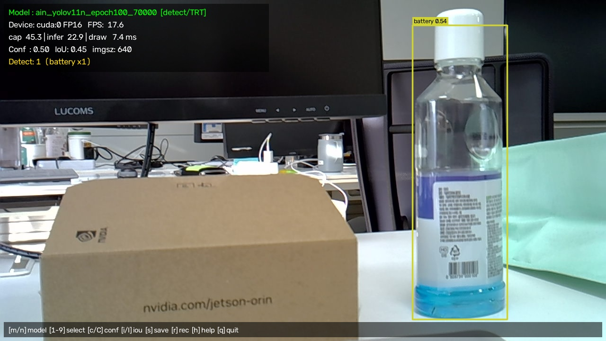

# Jetson 쓰레기 검출 (Trash Detection)

YOLO 모델로 카메라 영상에서 쓰레기를 실시간 검출하고, 검출된 품목을
**지자체별 분리수거 안내**로 바꿔 화면에 띄우는 데스크톱 실행기입니다.

**Jetson Orin Nano (JetPack 6 / CUDA 12.6) 에서 테스트했습니다.**
TensorRT 엔진을 자동으로 골라 쓰며, CUDA를 못 쓰는 환경에서는 CPU로 떨어지되
그 이유와 해결 방법을 콘솔에 출력합니다.



> Jetson Orin Nano + USB 웹캠, TensorRT FP16 엔진 · 640 입력 기준 화면.

## 주요 기능

- **모델 실시간 전환** — `model/` 안의 여러 가중치를 실행 중에 키(`m`/`n`/`Space`)로 바꿔가며 비교
- **TensorRT 자동 선택** — 같은 이름의 `.engine` 과 `.pt` 가 있으면 빠른 `.engine` 을 사용 (`--no-engine` 으로 비교 가능)
- **분리수거 안내 패널** — 검출된 클래스 → 분리수거 카테고리 → 지역별 배출 방법 (제주 / 서울 / 전국 공통)
- **병목 진단** — 캡처 / 추론 / 표시 단계별 소요 시간을 나눠 측정하고, 종료 시 무엇을 손봐야 하는지 알려줌
- **노출 수동 조절** — 역광에서 자동노출이 배경에 맞춰 전경이 까맣게 나올 때 `,` / `.` 로 조정
- **스냅샷 / 녹화** — `s` 로 현재 화면 저장, `r` 로 mp4 녹화
- 웹캠(V4L2/MJPG) · Jetson CSI 카메라(`--csi`) · 동영상 파일 입력 지원

## 요구 사항

- Python 3.10+
- `ultralytics`, `opencv-python`, `numpy`, `torch` / `torchvision`
- `Pillow` — 화면에 한글을 그리는 데 사용 (없으면 한글이 깨지고 영어만 정상 표시)
- 한글 폰트 — `sudo apt install fonts-noto-cjk`

Jetson 에서는 **JetPack 전용 PyTorch 휠**이어야 GPU를 씁니다. 일반 PyPI 휠은
`torch.cuda.is_available()` 이 조용히 `False` 가 되어 FPS만 10배 느려집니다.
JetPack 6 / CUDA 12.6 기준:

```bash
pip3 install --index-url https://pypi.jetson-ai-lab.io/jp6/cu126 \
    torch==2.8.0 torchvision==0.23.0
```

## 실행

```bash
python3 main.py                         # 기본 카메라 + 저장된 설정으로 실행
python3 main.py --list-models           # model/ 안의 모델 목록만 출력
python3 main.py --model 0_seg_yolo11n_100epoch_70000 --quantize 16
python3 main.py --csi --flip-method 2   # Jetson CSI 카메라
python3 main.py --source sample.mp4     # 동영상 파일
python3 main.py --headless              # 창 없이 콘솔 출력만 (SSH 접속 등)
python3 main.py --benchmark 200         # 200 프레임 처리 후 단계별 평균 시간 출력
```

### 단축키

| 키 | 동작 |
|---|---|
| `m` / `n` | 다음 / 이전 모델 |
| `Space` | 모델 선택 메뉴 (숫자키로 선택, `ESC` 닫기) |
| `c` / `v` | confidence −0.05 / +0.05 |
| `i` / `o` | IoU −0.05 / +0.05 |
| `g` | 분리수거 안내 지역 전환 |
| `,` / `.` | 노출 어둡게 / 밝게 · `0` 자동노출 복귀 |
| `s` / `r` | 스냅샷 저장 / 녹화 토글 |
| `d` | conf·IoU·노출·지역을 기본값으로 |
| `h` | 단축키 표시 토글 |
| `q` / `ESC` | 종료 |

### 주요 옵션

| 옵션 | 설명 |
|---|---|
| `--quantize {8,16,32}` | 추론 정밀도. `16`(FP16) 권장 |
| `--imgsz N` | 추론 입력 크기. 낮추면 빨라짐 (640 → 416 → 320) |
| `--cam-size 640x480` | 캡처 해상도. 캡처가 병목일 때 낮춤 |
| `--display-scale 0.5` | 표시 배율. 녹화·스냅샷도 이 배율을 따름 |
| `--no-engine` | `.engine` 대신 `.pt` 사용 (검출 결과 비교용) |
| `--region jeju` | 분리수거 안내 지역 · `--no-guide` 로 패널 끄기 |
| `--exposure 300` | 수동 노출값 (역광 보정) |
| `--reset-config` | 저장된 설정을 전부 기본값으로 되돌리고 시작 |

## TensorRT 엔진 만들기

`.pt` 그대로 돌려도 동작하지만, TensorRT로 내보내면 보통 **2~4배** 빨라집니다.

```bash
python3 tools/export_engine.py --all --quantize 16
python3 tools/export_engine.py --model ain_yolov11n_epoch100_70000
```

내보낸 `.engine` 은 `model/` 에 같은 이름으로 저장되고, `main.py` 가 자동으로
고릅니다. `src/detector.py` 의 `discover_models()` 가 `model/` 안에서 같은
이름의 `.engine` 과 `.pt` 를 짝지어 `.engine` 을 우선 고르기 때문에, 변환만 해
두면 실행 쪽은 건드릴 것이 없습니다.

`.onnx` 는 `.pt` → `.engine` 변환 과정에서 자동으로 생기는 중간 산출물입니다.
따로 만들 필요도, 지울 필요도 없습니다.

### 저장소에 `.engine` / `.onnx` 가 없는 이유

이 저장소에는 `.pt` 가중치만 올려두었습니다. 받아서 바로 쓰려고 `.engine` 을
찾았다면, **없는 게 맞고 각자 장비에서 만들어야 합니다.**

- **엔진은 만든 장비에 묶입니다.** TensorRT는 빌드할 때의 GPU 아키텍처
  (Orin = `sm_87`), TensorRT / CUDA 버전, JetPack 버전에 맞춰 커널을 고릅니다.
  조건이 하나라도 다르면 로딩 단계에서 실패하거나 오동작합니다. 같은 Orin Nano
  라도 JetPack을 올렸다면 다시 만들어야 합니다.
- **옵션이 바뀌면 다시 만들어야 합니다.** 엔진에는 `--imgsz`, `--quantize`,
  `--batch` 가 구워져 들어갑니다. `--imgsz 416` 으로 돌려보려면 그 크기로 다시
  내보내야 합니다.
- **용량이 큽니다.** `.engine` + `.onnx` 를 합치면 `.pt` 만 올릴 때보다
  190MB 이상 늘어납니다. 매번 다시 만들어야 하는 파일을, 그것도 바이너리라
  변경 이력이 전혀 남지 않는 파일을 커밋할 이유가 없습니다.

그래서 `.gitignore` 에서 제외하고 있습니다.

```gitignore
model/*.engine
model/*.onnx
```

### 그래도 저장소에 넣어야 한다면

같은 이미지로 굳어진 장비 여러 대에 배포하는 경우처럼, 엔진을 그대로 공유하는
편이 나은 상황도 있습니다. 그럴 때는 `.gitignore` 의 위 두 줄을 지우거나,
무시 규칙을 그대로 둔 채 특정 파일만 강제로 추가하면 됩니다.

```bash
git add -f model/0_seg_yolo11n_100epoch_70000.engine
```

다만 파일 하나가 100MB를 넘으면 GitHub가 푸시를 거부하므로, 그때는
[Git LFS](https://git-lfs.com) 로 관리해야 합니다.

```bash
git lfs install
git lfs track "model/*.engine"
git add .gitattributes
```

덧붙여, 엔진을 공유하더라도 **받는 장비의 JetPack / TensorRT 버전이 만든
장비와 같아야** 합니다. 버전이 다르면 `.engine` 은 무시하고 `.pt` 로 돌리는
편이 안전합니다 (`--no-engine`).

## 구조

```
main.py                         실행 루프 · 키 입력 · 벤치마크
tools/export_engine.py          .pt -> TensorRT .engine 변환
src/
  config.py                     기본값 / config.json 로드·저장
  detector.py                   모델 탐색·로딩·전환, CUDA 진단
  webcam.py                     웹캠 / CSI / 파일 입력 (최신 프레임만 유지)
  recycling_guide.py            클래스 -> 카테고리 -> 지역별 안내
  ui.py                         HUD · 안내 패널 · 검출 박스 (한글 렌더링)
config/recycling_guide.json     분리수거 매핑 규칙
model/                          YOLO 가중치 (.pt 만 저장소에 포함, .engine/.onnx 는 각자 생성)
output/                         스냅샷 / 녹화 결과
```

실행 중 바꾼 설정(모델·conf·IoU·노출·지역)은 종료할 때 `config.json` 에
저장되어 다음 실행에 이어집니다. 기본값은 `src/config.py` 의 `DEFAULT_CONFIG` 입니다.

## 분리수거 안내 규칙

`config/recycling_guide.json` 하나가 기준입니다.

- `classes` — 모델 클래스명 → 카테고리 id (정확 매칭)
- `rules` — 부분 문자열 규칙 (`classes` 에 없을 때)
- `fallback` — 그래도 못 찾으면 `general`(일반 쓰레기)
- `ignore` — 사람·차량·가구 등 쓰레기가 아닌 클래스는 안내에서 제외
- `regions` — 지자체별 배출 방법 덮어쓰기 + 공지 문구

모델 클래스가 바뀌면 이 JSON만 고치면 됩니다. 같은 파일을 Flutter 앱
(`trash_sorter`) 과 공유하며, 앱은 GPS로 지역을 자동 판별하지만 여기서는
GPS가 없어 `g` 키로 직접 고릅니다.

## 문제 해결

**FPS가 5~10 근처에서 안 올라간다**
캡처가 병목입니다. USB 2.0 대역폭 때문에 기본 포맷(YUYV)은 720p에서 5~10 FPS로
묶입니다. MJPG가 적용됐는지 확인하세요.

```bash
v4l2-ctl -d /dev/video0 --list-formats-ext
```

**"CPU로 실행합니다" 경고가 뜬다**
Jetson GPU(sm_87)용으로 빌드되지 않은 PyTorch 휠입니다. 위 [요구 사항](#요구-사항)의
JetPack 전용 휠을 설치하세요.

**추론이 병목이다**
`tools/export_engine.py` 로 TensorRT 엔진을 만들고, `--quantize 16`, `--imgsz 416` 을
시도하세요. 전력 모드도 확인합니다.

```bash
sudo nvpmodel -q          # MAXN 이 아니면
sudo nvpmodel -m 0 && sudo jetson_clocks
```

**화면 표시가 병목이다**
SSH(X11 포워딩)로 띄우고 있다면 그것이 원인입니다. `--headless` 또는
`--display-scale 0.5` 로 확인하세요.

**화면이 까맣게 나온다 (역광)**
`.` 키로 노출을 올리거나 `--exposure 300` 으로 시작하세요. `0` 키로 자동노출 복귀.

**한글이 물음표로 깨진다**
`pip3 install Pillow` 와 `sudo apt install fonts-noto-cjk` 를 설치하세요.

## QSEXFProject2 동기화

이 저장소가 원본이고, 팀 저장소 `lnh24390/QSEXFProject2` 의
`trash_detection_project/07_jetson_trash_detection/` 은 사본입니다.
수정은 항상 이 저장소에서 하고, 반영은 아래 스크립트로 합니다.

```bash
tools/sync_to_qsexf.sh                 # 마지막 커밋 제목을 설명으로 사용
tools/sync_to_qsexf.sh "노출 조절 추가"   # 설명 직접 지정
```

`git push` 할 때 `.git/hooks/pre-push` 가 이 스크립트를 자동으로 실행합니다.
동기화가 실패해도 이 저장소로의 푸시 자체는 막지 않고 경고만 남깁니다.
직접 돌리려면 위 명령을 쓰면 됩니다.

스크립트는 **커밋된 파일만** 07 폴더로 복사하므로 작업 중인 파일이나
`output/` 산출물이 섞이지 않습니다. 대상 저장소에는 `.github/` 와
가중치(`*.pt`, 약 158MB)를 넣지 않습니다 — 상위
`trash_detection_project/.gitignore` 가 막고 있고, 가중치는 원본인 이
저장소에서 받으면 됩니다. 커밋은 07 폴더만 스테이징하므로 팀원이 작업 중인
다른 파일은 건드리지 않습니다.

대상 저장소 클론이 `~/Desktop/QSEXFProject2/QSEXFProject2` 가 아니라면
`QSEXF_DIR` 로 경로를 지정하세요.

```bash
QSEXF_DIR=/path/to/QSEXFProject2 tools/sync_to_qsexf.sh
```
